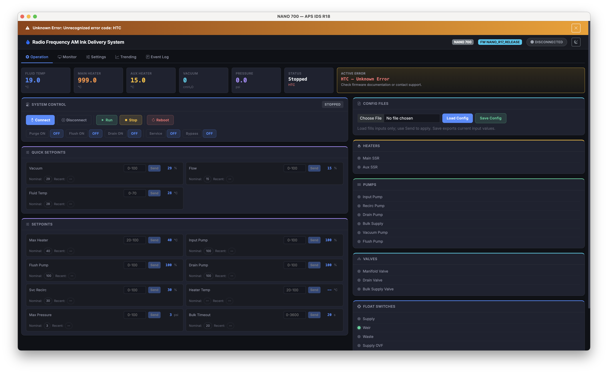
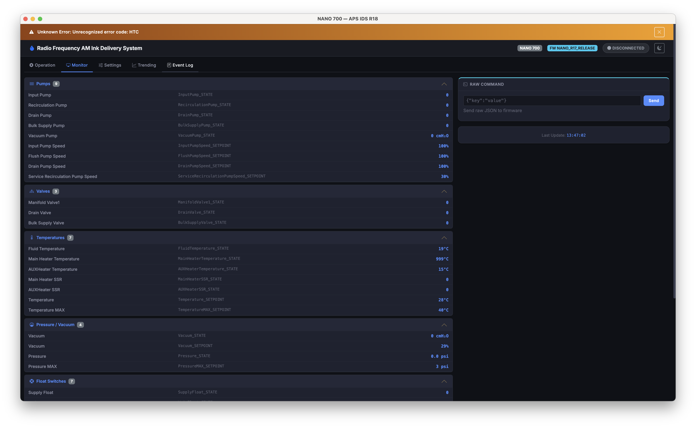
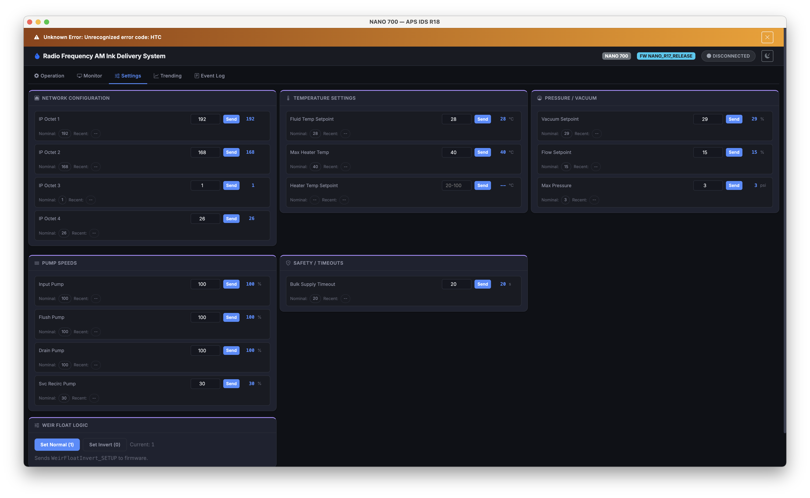
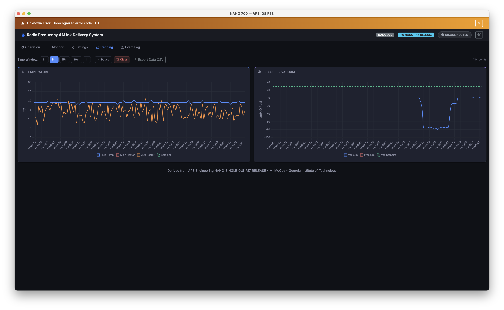
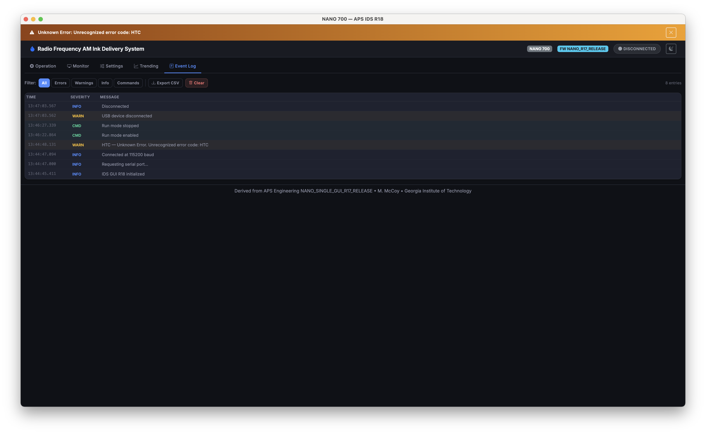
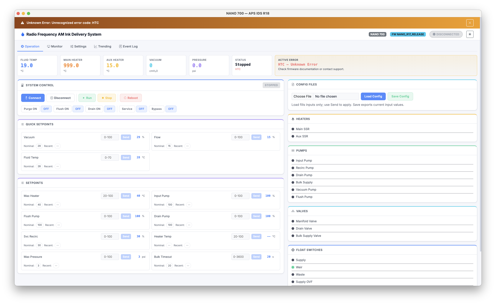

# Radio Frequency AM Ink Delivery System

Desktop UI for the Radio Frequency AM Ink Delivery System (derived from APS Engineering NANO_SINGLE_GUI_R17_RELEASE). This is for use with the APS Engineering NANO 700 system.

## Get The Files

You have two easy options:

1. Clone with Git (recommended if you have Git installed)
   ```bash
   git clone https://github.com/mattlmccoy/ids-gui.git
   ```
2. Download ZIP (no Git needed)
   1. Open the repo page in your browser.
   2. Click **Code** → **Download ZIP**.
   3. Unzip it wherever you want.

## Pick A Folder

From here on, you must run commands **inside the project folder**. Example:

```bash
cd /path/to/ids-gui
```

On macOS, if you moved it to your Desktop:

```bash
cd ~/Desktop/ids-gui
```

## Quick Start (Electron App)

1. Install dependencies:
   ```bash
   npm install
   ```
2. Build the desktop app (required after install or updates):
   ```bash
   npm run dist
   ```
2. Run the app:
   ```bash
   npm run start
   ```

## Windows Desktop Shortcut (Easy Launch)

1. Make sure you have run `npm install` in the project folder at least once.
2. Locate `run-app.bat` in the project folder.
3. Right‑click `run-app.bat` → **Create shortcut**.
4. Drag the new shortcut to your Desktop.
5. Double‑click the shortcut to launch the app.

Tip: Right‑click the shortcut → **Properties** → **Change Icon…** to customize it.

## Quick Start (Local Server + Chrome)

1. Start a local server:
   ```bash
   python3 -m http.server 8080
   ```
2. Open Chrome/Edge:
   ```
   http://localhost:8080
   ```

Notes:
- Web Serial requires Chrome or Edge.
- If you skip the local server and open `index.html` directly, modules may not load.

## Build Installers (macOS / Windows / Linux)

You must run this after any install or update:

```bash
npm run dist
```

Artifacts are produced in `dist/`:
- macOS: `.dmg` / `.zip`
- Windows: `.exe` (NSIS) / `.zip`
- Linux: `.AppImage` / `.deb`

## Notes

- Web Serial support is required. The Electron build enables the Serial feature flag.
- Vendor assets (Bootstrap, Chart.js, etc.) are copied locally via `npm run copy-vendor`.

## Troubleshooting

- **`npm: command not found`**
  - Install Node.js from https://nodejs.org/ (use the LTS version), then re-run `npm install`.
- **`npm run dist` says “Missing script: dist”**
  - You’re likely in the wrong folder. Run `pwd` and confirm you’re inside the `ids-gui` folder.
- **No serial devices appear / Connect does nothing**
  - Use Chrome or Edge for the local server flow.
  - Check the USB cable and confirm the device is powered.
  - If multiple devices are connected, use the selector when prompted.
- **App loads but looks broken**
  - Make sure you started a local server and didn’t open `index.html` directly.

## Screenshots

Operation (Dark)


Monitor


Settings


Trending


Event Log


Operation (Light)

