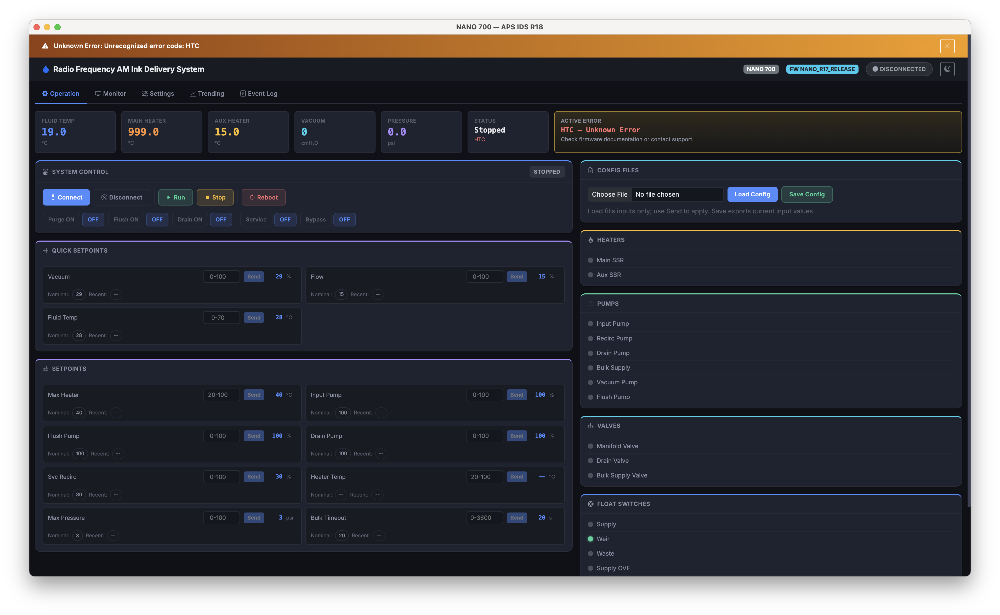
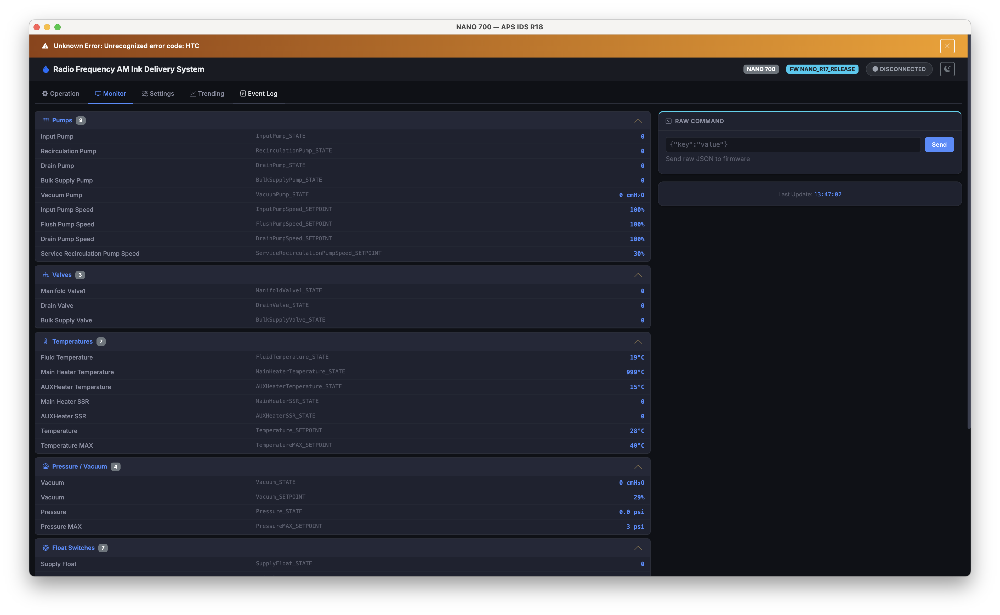
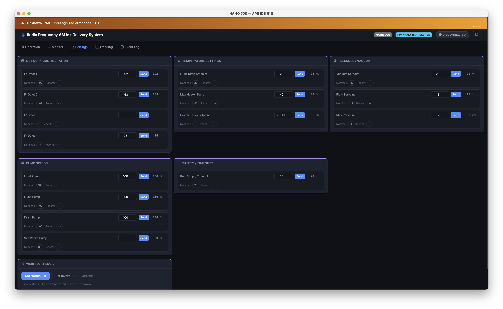
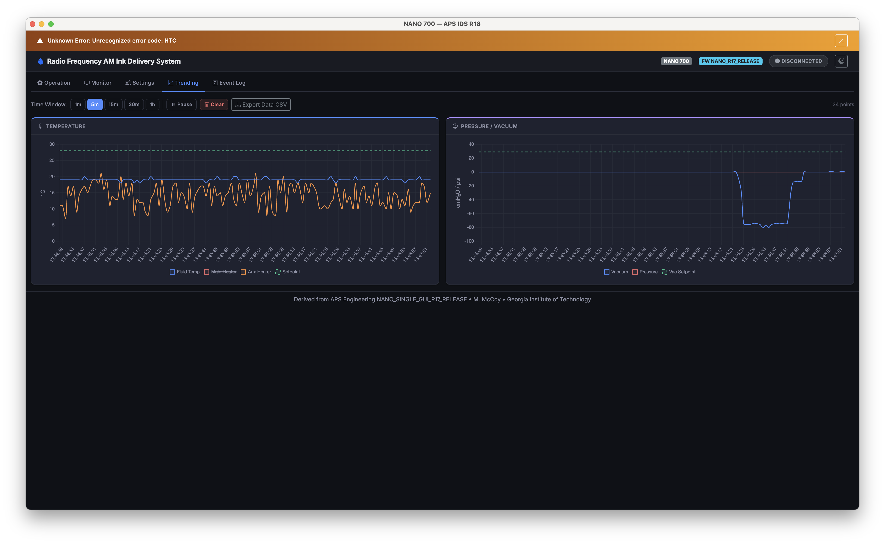
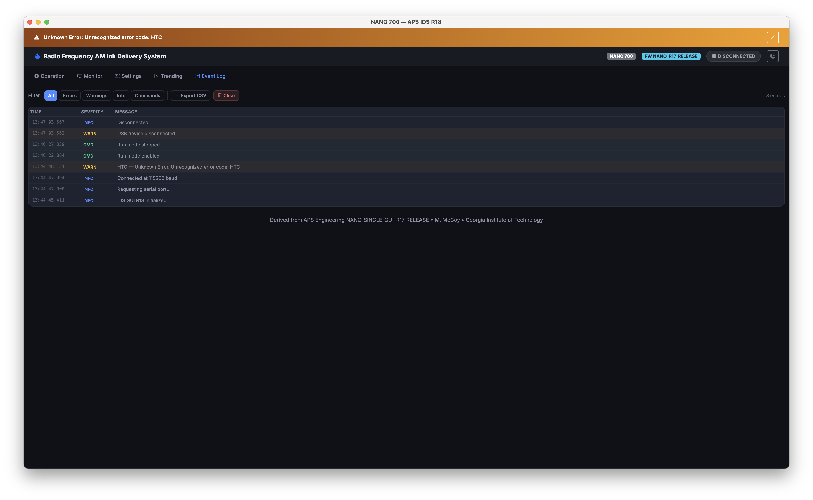
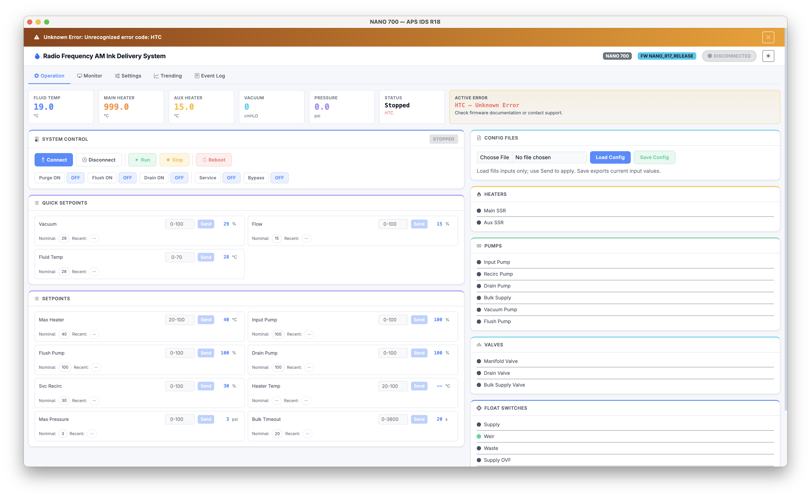

# Radio Frequency AM Ink Delivery System

Desktop UI for the Radio Frequency AM Ink Delivery System (derived from APS Engineering NANO_SINGLE_GUI_R17_RELEASE). This is for use with the APS Engineering NANO 700 system.

## Get The Files

You have two easy options:

1. Clone with Git (recommended if you have Git installed)
   ```bash
   git clone https://github.com/mattlmccoy/ids-gui.git
   ```
2. Download ZIP (no Git needed)
   1. Open the repo page in your browser.
   2. Click **Code** -> **Download ZIP**.
   3. Unzip it wherever you want.

## Pick A Folder

From here on, run commands inside the project folder.

```bash
cd /path/to/ids-gui
```

## Quick Start (Electron App)

1. Install dependencies:
   ```bash
   npm install
   ```
2. Build desktop app (required after install or updates):
   ```bash
   npm run dist
   ```
3. Run the app:
   ```bash
   npm run start
   ```

## Quick Start (Local Server + Chrome)

1. Start local server:
   ```bash
   python3 -m http.server 8080
   ```
2. Open Chrome/Edge:
   ```
   http://localhost:8080
   ```

Notes:
- Web Serial requires Chrome or Edge.
- If you open `index.html` directly, modules may not load.

## Hosted Web App (GitHub Pages)

The repository includes an automated GitHub Pages deployment. Once Pages is enabled with
**GitHub Actions** as its source, the app is available at:

<https://mattlmccoy.github.io/ids-gui/>

Pushes to `main` automatically test and deploy the latest browser assets. No local companion
is required: desktop Chrome or Edge connects directly to the USB controller through Web Serial.
See `GITHUB_PAGES.md` for setup, update, browser-storage, and troubleshooting details.

## Build Installers (macOS / Windows / Linux)

```bash
npm run dist
```

Artifacts are produced in `dist/`:
- macOS: `.dmg` / `.zip`
- Windows: `.exe` (NSIS) / `.zip`
- Linux: `.AppImage` / `.deb`

## Ink Check Tool

The app now includes a dedicated **Ink Check** tab for IPA-based ink concentration tracking and reconstitution planning.

### Core capabilities
- Per-sample logging of:
  - Bottle state (`brand new` / `opened`)
  - Ink family (for example `IPA 25 wt%`)
  - Nominal wt% at sample
- Known sample volume (mL)
  - Sample mass (g)
  - Current bottle volume (mL)
  - Notes and baseline flag
- Family-scoped analysis (one ink family at a time)
- Density and IPA add-back trend plotting
- Bottle-basis IPA add-back estimate
- In-the-moment aliquot IPA add-back calculator (g and mL)
- Reminder prompt/snooze for overdue checks

### Data persistence and portability
- Auto-load/auto-save persistent JSON file in Electron user data folder.
- Manual controls: `Load Stored`, `Save Stored`, `Import JSON`, `Export JSON`, `Export CSV`.
- Cross-platform path examples:
  - macOS: `~/Library/Application Support/rf-am-ink-delivery-system/ink-check-data.json`
  - Windows: `%APPDATA%\\rf-am-ink-delivery-system\\ink-check-data.json`

### Technical reference
- Full technical sheet:
  - `INK_CHECK_TECHNICAL_SHEET.md`
- Sample 2-week dataset:
  - `ink-check-sample-data-2weeks.json`

## Other major GUI updates in this release
- Operation tab: `Send All` reliability/progress updates.
- Config load/send flow robustness improvements.
- Heater visibility controls integrated with cards/charts/error handling.
- Active error dismissal workflow and improved alarm UX.
- Nominal config support and nominal-send workflow.
- Trending chart axis/legend/unit behavior improvements.
- Poll interval control in trending view.
- Firmware-aligned mode behavior updates (Purge/Flush/Drain/Bypass).

## Changelog

See `CHANGELOG.md` for full release notes.

## Notes

- Web Serial support is required. The Electron build enables Serial feature flags.
- Vendor assets (Bootstrap, Chart.js, etc.) are copied locally via `npm run copy-vendor`.
- The latest software/protocol review is documented in `SYSTEM_AUDIT.md`.
- Trends uses the same explicit time bounds for pressure/vacuum and machine-state history.
  Individual float, pump, and valve lanes can be selected and stored as a browser preference.
- Settings includes persisted Weir OVF display inversion and opt-in local overflow notifications.
- Remote alerts are edge-triggered and cover Weir/Supply overflow, firmware alarms,
  unexpected controller disconnects, and stale telemetry, with recovery events and
  duplicate suppression. Each alert/recovery category can be enabled independently in
  Settings. Every category has a test-fire control that exercises Slack/ntfy delivery
  without changing the Worker's real incident state; a general test is also available.
- Commissioning is one guided workflow: passive checks advance automatically; Run/vacuum,
  Flush, Drain, and Bypass introduce locally gated automation at their relevant step; and
  notification delivery is tested inside the Alerts steps. Every data-bearing test includes
  a live evidence plot. Automated circuits require live alarm telemetry and explicit safety
  acknowledgements, verify two consecutive readbacks, abort on alarms/disconnects, command
  all modes OFF at both boundaries, and complete linked mode/actuator checks together only
  after operator confirmation of physical behavior.
- The remote dashboard now includes allowlisted, read-only live system telemetry for phones.
- Mobile control uses a separate operator token and an expiring Worker command queue. The
  desktop must be connected and locally enabled for 30 minutes; only Run, Stop, vacuum,
  flow, and fluid-temperature setpoints are accepted, and serial readback is audited.
- Ink Check now defaults to a 1 mL sample, captures temperature, previews density,
  rejects suspect measurements for dosing, sorts imports chronologically, and segments
  historical calculations at each new baseline. The invalid density-ratio model has been
  removed: concentration now requires monotonic known calibration points, uses interpolation
  only, never extrapolates, and enforces calibration-temperature compatibility.
- Lab Validation is a one-time/reservice commissioning workflow. It presents one queued test
  at a time, automatically analyzes identity, telemetry, binary readbacks, sensors, alarm and
  disconnect lifecycles, and requires explicit human confirmation for physical behavior.
- Navigation follows the normal lifecycle: Operation, Trends, Live I/O, Ink Check, Event Log,
  Settings, then infrequent Commissioning.
- `HTC`, `HTC_ERROR`, and error bit `8192` are decoded as a heater thermocouple input fault;
  live Main/Aux readings identify the affected channel and explain the 999 °C fault sentinel.
- Settings has persistent **Main heater installed** and **AUX heater installed** switches. For
  an AUX-only machine, turn off Main. This filters the unused channel and a clearly attributable
  HTC input fault in the web app; it does not electrically disable a heater or change firmware.

## Troubleshooting

- **`npm: command not found`**
  - Install Node.js LTS from https://nodejs.org/ and re-run `npm install`.
- **No serial devices appear / Connect does nothing**
  - Use Chrome/Edge for local-server flow.
  - Check USB cable/power.
  - Use selector when multiple devices are connected.
- **App appears dimmed on startup**
  - Update to latest code. Ink-check modals are now tab-scoped to avoid hidden-tab backdrops.
- **A deployed control is still missing after Force update**
  - Current Pages builds version the entry point, every nested JavaScript module, and the
    stylesheet with the same commit identifier. Open `update.html` once, then reload the app;
    the build badge should change to the latest short commit.

## Screenshots

Operation (Dark)


Monitor


Settings


Trending


Event Log


Operation (Light)

